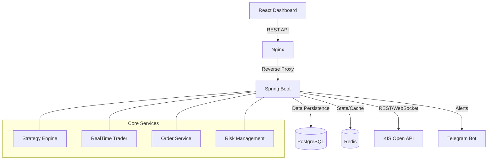

# Project AntiGravity: 초고가용성 하이브리드 주식 트레이딩 시스템

**AntiGravity**는 한국투자증권(KIS) Open API를 기반으로 한 알고리즘 트레이딩 시스템입니다. Spring Boot와 React를 사용하여 프로덕션 레벨의 안정성을 확보하고, 실시간 시세 처리와 백테스팅, 리스크 관리 기능을 통합적으로 제공합니다.

## 🚀 주요 기능 (Key Features)

### 1. 코어 트레이딩 엔진
- **KIS API 연동 (한국투자증권)**:
  - **REST API**: 계좌 잔고 조회(`Balance`), 일/분봉 차트 데이터 수집(`Daily/Minute Chart`), 주식 주문(`Order`).
  - **WebSocket (실시간)**: 실시간 체결가(`H0STCNT0`) 수신 및 즉각적인 신호 처리.
- **멀티 전략 시스템 (Multi-Strategy Engine)**:
  - **Strategy Registry**: 다양한 트레이딩 전략을 플러그인 형태로 확장 가능.
  - **탑재 전략**:
    1. **S1_TrendMomentum (Trend)**: 추세추종 및 돌파 매매 (MA20 + 거래량).
    2. **S2_RsiScalp (Counter-Trend)**: RSI 30/70 기반 역추세 스캘핑.
    3. **S3_SupportResistance (Price Action)**: 당일 지지/저항 라인 기반 매매.
    4. **S4_Ensemble (Hybrid)**: 추세, 모멘텀, 기술적 지표를 종합한 앙상블 모델.
- **주문 관리 (Order Execution)**:
  - 매수/매도 주문 실행 및 체결 내역 DB 로깅 (`TradeLog`).
  - 시뮬레이션 모드 지원 (실제 계좌 연동 전 테스트).

### 2. 리스크 관리 (Risk Management)
- **Global Kill Switch**:
  - Redis를 활용한 글로벌 제어 플래그.
  - 대시보드에서 클릭 한 번으로 모든 자동 매매 프로세스 즉시 중단.
- **Daily Loss Limit (일일 손실 제한)**:
  - 당일 손실금액이 설정된 한도(-5%)를 초과하면 자동으로 Kill Switch가 발동되어 추가 손실 방지.

### 3. 백테스팅 (Backtesting)
- **전략 시뮬레이터**:
  - `TrendMomentumStrategy` 로직을 과거 데이터에 대입하여 성과 검증.
  - 수익률(Win Rate), 총 손익(Total PnL) 자동 계산.
  - 프론트엔드 대시보드를 통해 날짜 및 종목별 백테스트 실행 가능.

### 4. 대시보드 (Frontend Dashboard)
- **실시간 모니터링**:
  - **내 계좌 현황**: 총 평가금액, 주문 가능 예수금 실시간 표시.
  - **보유 종목(Portfolio)**: 현재 보유 종목 리스트 및 실시간 등락률/평가손익 확인.
  - **시장 시세**: 관심 종목의 일/분봉 차트 시각화 (`TradingView Lightweight Charts`).
  - **거래 기록 (Trade History)**: 실시간 체결된 매매 로그 리스트 (상세 로직별 사유 포함).
- **Control Panel**:
  - **종목 검색**: 코스피/코스닥 전 종목 검색 및 자동완성.
  - **전략 선택**: 드롭다운 메뉴를 통해 백테스트/실전매매 전략 선택 및 파라미터(JSON) 튜닝.
  - **제어**: 글로벌 킬스위치(Kill Switch) 및 백테스트 실행.

### 5. 알림 시스템 (Notification)
- **Telegram Bot 연동**:
  - **매매 알림**: 매수/매도 주문 체결 시 즉시 메시지 발송 (종목, 가격, 수량).
  - **시스템 알림**: Kill Switch 발동 등 중요 시스템 이벤트 수신.
  - **테스트 기능**: API를 통해 강제 알림 발송 테스트 가능.

## 🛠 기술 스택 (Tech Stack)

| 영역 | 기술 |
|---|---|
| **Backend** | Java 17, Spring Boot 3.2, Spring Data JPA, WebFlux |
| **Database** | PostgreSQL 15, Redis (Cache/State) |
| **Frontend** | React 18, TypeScript, Vite, Tailwind CSS, Recharts / Lightweight Charts |
| **Infra** | Docker, Docker Compose, Nginx |
| **External** | Korea Investment Securities (KIS) Open API |

## 🏗 아키텍처 (Architecture)



## 🏁 시작하기 (Getting Started)

### 사전 준비사항
1. **Docker & Docker Compose** 설치.
   - [Docker Desktop 다운로드](https://www.docker.com/products/docker-desktop/)
2. **KIS API 계좌 및 키** 발급 (AppKey, AppSecret).
   - 한국투자증권 Open API 신청 필요.
   - 모의투자/실전투자 계좌 준비.
3. **환경 설정 (Application Config)**
   - `backend/src/main/resources/application.yml` 파일을 열어 다음 정보를 입력하세요.
     ```yaml
     kis:
       app-key: "YOUR_APP_KEY"
       app-secret: "YOUR_APP_SECRET"
       account-no: "YOUR_ACCOUNT_NO" # 12345678-01 형식
       base-url: "https://openapivts.koreainvestment.com:29443" # 모의투자
       # 실전투자는 "https://openapi.koreainvestment.com:9443"

     telegram:
       bot-token: "8513797541:..."
       chat-id: "-5091739784" # 그룹 Chat ID
     ```
   - *주의: 이 파일은 git에 커밋되지 않도록 주의하세요.*

### 실행 방법 1: 전체 시스템 (Docker Compose 권장)
프로젝트 루트에서 다음 명령어 하나로 Backend, Frontend, DB, Redis를 한 번에 실행합니다.

```bash
# 실행
docker-compose up --build

# 백그라운드 실행 시
docker-compose up -d --build
```

- **대시보드 접속**: [http://localhost:5173](http://localhost:5173)
- **API 서버**: [http://localhost:8080](http://localhost:8080)

### 실행 방법 2: 개별 실행 (개발용)

**Backend (Spring Boot)**:
```bash
cd antigravity/backend
./gradlew build
java -jar build/libs/antigravity-backend-0.0.1-SNAPSHOT.jar
# 또는 IDE(IntelliJ)에서 main 실행
```

**Frontend (React)**:
```bash
cd antigravity/frontend
npm install
npm run dev
```
- Frontend 접속: `http://localhost:5173`

### 주요 기능 테스트
- **매매 알림 테스트**:
  ```bash
  curl -X POST http://localhost/api/notifications/test -H "Content-Type: application/json" -d '{"type":"TRADE"}'
  ```
- **백테스트 실행**: 대시보드의 'Backtest Panel'에서 'Run Backtest' 버튼 클릭.

## 🧪 백테스트 시나리오 (API Examples)
`LOOSE` 모드를 사용하여 검증 가능한 트레이딩 시그널을 생성할 수 있습니다. 아래 명령어를 터미널에 붙여넣어 테스트하세요.

### 1. Loose Mode + 1 Month (단일 종목)
```bash
curl -X POST "http://localhost:8080/api/backtest?symbol=005930&start=2024-01-01T09:00:00&end=2024-02-01T15:30:00&mode=LOOSE"
```

### 2. Loose Mode + 3 Months (단일 종목)
```bash
curl -X POST "http://localhost:8080/api/backtest?symbol=005930&start=2024-01-01T09:00:00&end=2024-04-01T15:30:00&mode=LOOSE"
```

### 3. Loose Mode + 1 Month (유니버스 Top 5)
```bash
# 주요 우량주 5종목 연속 테스트
for sym in 005930 000660 035420 005380 000270; do
  echo "Testing $sym..."
  curl -s -X POST "http://localhost:8080/api/backtest?symbol=$sym&start=2024-01-01T09:00:00&end=2024-02-01T15:30:00&mode=LOOSE" | jq '.totalTrades, .finalBalance'
done
```

## 📁 프로젝트 구조

```
antigravity/
├── backend/            # Spring Boot Application
│   ├── src/main/java/com/antigravity/trading/
│   │   ├── controller/     # API Endpoints
│   │   ├── domain/         # Entities, DTOs, Strategy Logic
│   │   ├── infrastructure/ # External API Clients (KIS, Telegram)
│   │   └── service/        # Business Logic (Backtest, Order, Risk)
│   └── Dockerfile
├── frontend/           # React Application
│   ├── src/components/     # UI Components (Chart, Panel, TradeLog)
│   └── Dockerfile
├── docker-compose.yml  # Container Orchestration
└── README.md           # Documentation
```

---
**AntiGravity System v1.0.0**
