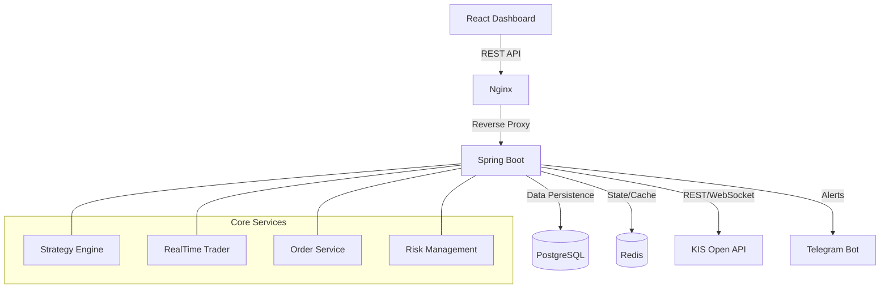

# Project AntiGravity: 초고가용성 하이브리드 주식 트레이딩 시스템

**AntiGravity**는 한국투자증권(KIS) Open API를 기반으로 한 알고리즘 트레이딩 시스템입니다. Spring Boot와 React를 사용하여 프로덕션 레벨의 안정성을 확보하고, 실시간 시세 처리와 백테스팅, 리스크 관리 기능을 통합적으로 제공합니다.

## 🚀 주요 기능 (Key Features)

### 1. 코어 트레이딩 엔진
- **KIS API 연동 (한국투자증권)**:
  - **REST API**: 계좌 잔고 조회(`Balance`), 일/분봉 차트 데이터 수집(`Daily/Minute Chart`), 주식 주문(`Order`).
  - **WebSocket (실시간)**: 실시간 체결가(`H0STCNT0`) 수신 및 즉각적인 신호 처리.
- **전략 (Trading Strategy)**:
  - **TrendMomentumV1**: 추세추종 및 모멘텀 전략.
    - **Trend**: 현재가가 20일 이동평균선(MA20) 위에 위치.
    - **Volume**: 거래량이 20일 평균 거래량의 80% 이상 발생.
    - **Breakout**: 전일 고가 돌파 시 매수 신호 발생.
- **주문 관리 (Order Execution)**:
  - 매수/매도 주문 실행 및 체결 내역 DB 로깅 (`TradeLog`).
  - 시뮬레이션 모드 지원 (실제 계좌 연동 전 테스트).

### 2. 리스크 관리 (Risk Management)
- **Global Kill Switch**:
  - Redis를 활용한 글로벌 제어 플래그.
  - 대시보드에서 클릭 한 번으로 모든 자동 매매 프로세스 즉시 중단.
- **Daily Loss Limit (일일 손실 제한)**:
  - 당일 손실금액이 설정된 한도(-5%)를 초과하면 자동으로 Kill Switch가 발동되어 추가 손실 방지.

### 3. 백테스팅 (Backtesting)
- **전략 시뮬레이터**:
  - `TrendMomentumStrategy` 로직을 과거 데이터에 대입하여 성과 검증.
  - 수익률(Win Rate), 총 손익(Total PnL) 자동 계산.
  - 프론트엔드 대시보드를 통해 날짜 및 종목별 백테스트 실행 가능.

### 4. 대시보드 (Frontend Dashboard)
- **실시간 모니터링**:
  - **내 계좌 현황**: 총 평가금액, 주문 가능 예수금 실시간 표시.
  - **보유 종목(Portfolio)**: 현재 보유 종목 리스트 및 실시간 등락률/평가손익 확인.
  - **시장 시세**: 관심 종목의 일/분봉 차트 시각화 (`TradingView Lightweight Charts`).
  - **거래 기록 (Trade History)**: 실시간 체결된 매매 로그 리스트 (사유, 신호 포함).
- **제어 패널**: 시스템 ON/OFF 스위치, 백테스트 패널.

### 5. 알림 시스템 (Notification)
- **Telegram Bot 연동**:
  - **매매 알림**: 매수/매도 주문 체결 시 즉시 메시지 발송 (종목, 가격, 수량).
  - **시스템 알림**: Kill Switch 발동 등 중요 시스템 이벤트 수신.
  - **테스트 기능**: API를 통해 강제 알림 발송 테스트 가능.

## 🛠 기술 스택 (Tech Stack)

| 영역 | 기술 |
|---|---|
| **Backend** | Java 17, Spring Boot 3.2, Spring Data JPA, WebFlux |
| **Database** | PostgreSQL 15, Redis (Cache/State) |
| **Frontend** | React 18, TypeScript, Vite, Tailwind CSS, Recharts / Lightweight Charts |
| **Infra** | Docker, Docker Compose, Nginx |
| **External** | Korea Investment Securities (KIS) Open API |

## 🏗 아키텍처 (Architecture)



## 🏁 시작하기 (Getting Started)

### 사전 준비사항
1. **Docker & Docker Compose** 설치.
2. **KIS API 계좌 및 키** 발급 (AppKey, AppSecret).
3. `backend/src/main/resources/application.yml` 설정 (API Key 입력).

### 실행 방법
프로젝트 루트에서 다음 명령어를 실행하면, Backend, Frontend, DB, Redis가 모두 구동됩니다.

```bash
docker-compose up --build
```

### 접속 주소
- **대시보드**: [http://localhost](http://localhost)
- **API 문서/테스트**: [http://localhost/api/notifications/test](http://localhost/api/notifications/test) (예시)

## 📁 프로젝트 구조

```
antigravity/
├── backend/            # Spring Boot Application
│   ├── src/main/java/com/antigravity/trading/
│   │   ├── controller/     # API Endpoints
│   │   ├── domain/         # Entities, DTOs, Strategy Logic
│   │   ├── infrastructure/ # External API Clients (KIS, Telegram)
│   │   └── service/        # Business Logic (Backtest, Order, Risk)
│   └── Dockerfile
├── frontend/           # React Application
│   ├── src/components/     # UI Components (Chart, Panel, TradeLog)
│   └── Dockerfile
├── docker-compose.yml  # Container Orchestration
└── README.md           # Documentation
```

---
**AntiGravity System v1.0.0**
